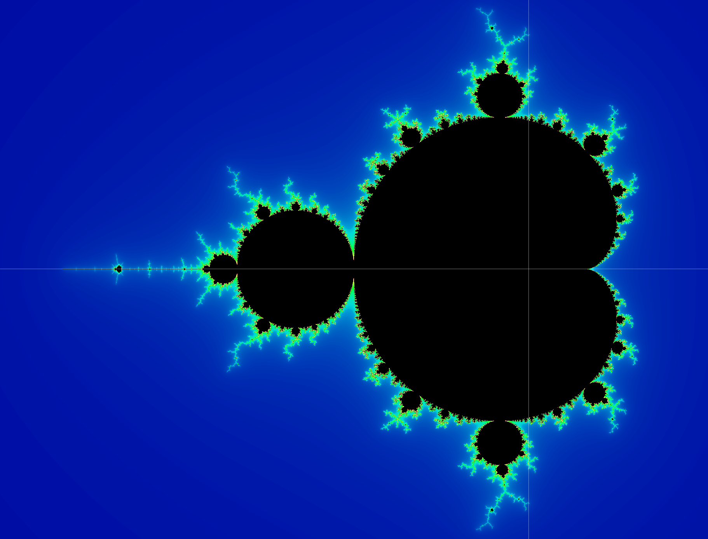
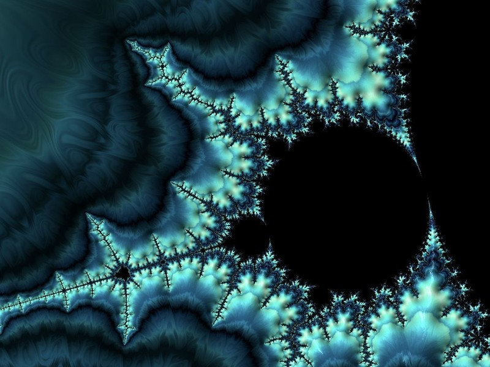
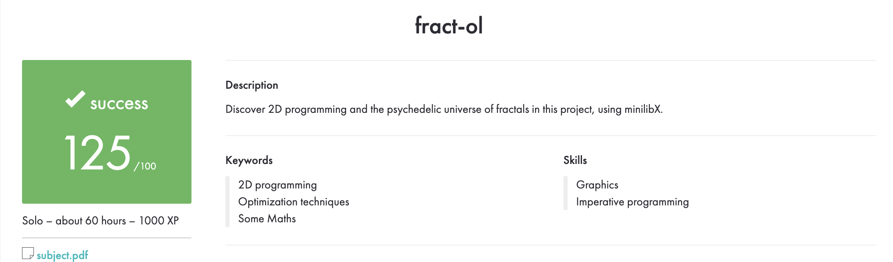

<div align="center">

# 🌀 fractol

### Explore the beauty of fractals in C

A small interactive fractal explorer built with **C** and **MiniLibX** as part of the 42 curriculum. Choose a fractal, zoom into its details, and experiment with colors and iteration depth.

[](https://en.wikipedia.org/wiki/C_(programming_language))
[](https://42kocaeli.com.tr/)

<br>

| 🌀 Mandelbrot | ✨ Fractal detail |
|:---:|:---:|
|  |  |

### 🎬 Watch fractol in action

<video src="https://raw.githubusercontent.com/sakkayaa/fractol/master/assets/fractol-demo.mp4" controls loop muted playsinline width="780">Your browser does not support embedded video. [Open the demo on GitHub](https://github.com/sakkayaa/fract-ol/blob/master/assets/fractol-demo.mp4).</video>

[▶️ Open the 35-second demo on GitHub](https://github.com/sakkayaa/fract-ol/blob/master/assets/fractol-demo.mp4)

</div>

## ✨ Fractals to explore

- **Mandelbrot** — the classic set, rich with intricate boundaries.
- **Julia** — explore a family of shapes controlled by complex parameters.
- **Celtic Mandelbrot** — a striking variation of the Mandelbrot set.
- **Burning Ship** — a distinctive fractal with flame-like structure.

## 🚀 Build and run

> This project uses the macOS version of MiniLibX and links against AppKit and OpenGL.

```bash
make
./fractol mandelbrot
```

Choose another fractal:

```bash
./fractol julia
./fractol julia -0.6 0.6
./fractol celtic_mandelbrot
./fractol burning_ship
```

## 🎮 Controls

| Action | Control |
| --- | --- |
| Zoom in / out | Mouse wheel |
| Move around | Arrow keys |
| Change fractal | `1` Mandelbrot · `2` Julia · `3` Celtic Mandelbrot · `4` Burning Ship |
| Change color palette | `C` |
| Increase / decrease detail (iterations) | `+` / `-` |
| Reset view | `R` |
| Lock / unlock Julia mouse interaction | `Space` |
| Quit | `Esc` |

## 🧰 Makefile commands

```bash
make        # Build the program and its bundled libraries
make clean  # Remove object files
make fclean # Remove object files and the executable
make re     # Clean and rebuild
```

## 🏅 42 evaluation

The project received a **successful score of 125/100**. The evaluation summary is included below.



## 👩‍💻 About

Created by **Sedef Akkaya** as a 42 School graphics project.

- GitHub: [@sakkayaa](https://github.com/sakkayaa)
- LinkedIn: [Sedef Akkaya](https://www.linkedin.com/in/sedef-akkaya-0a5580228/)
